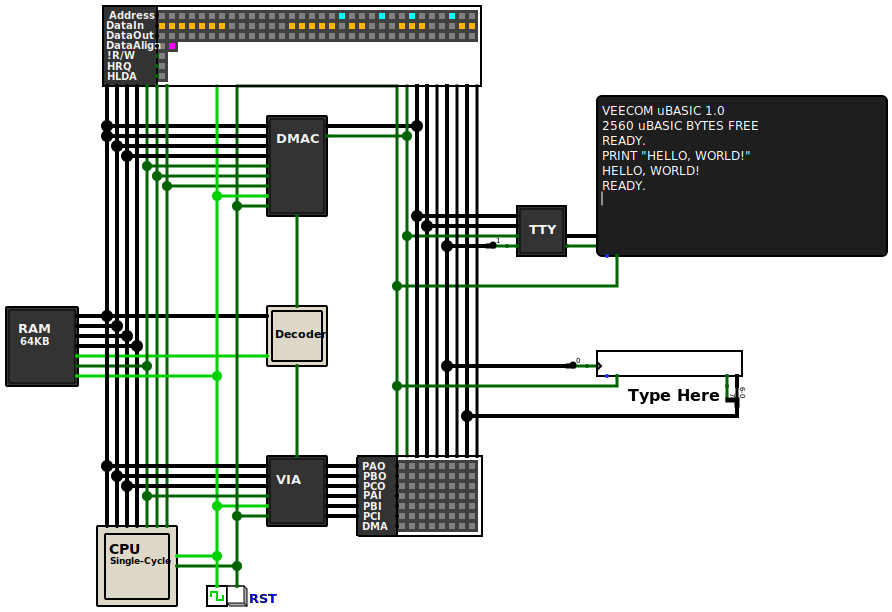
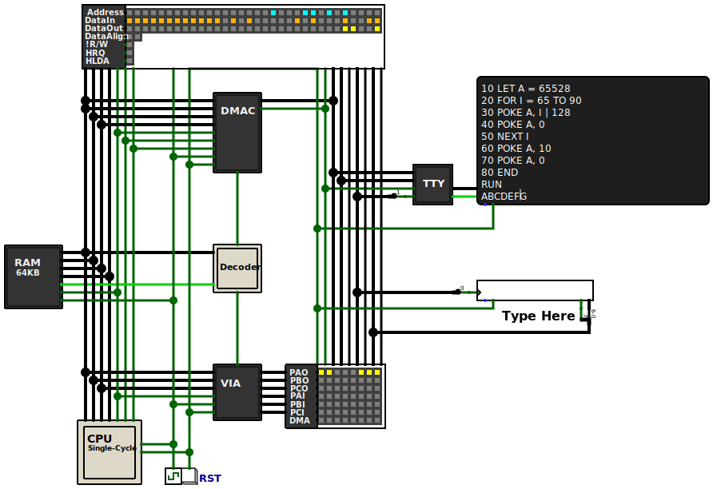
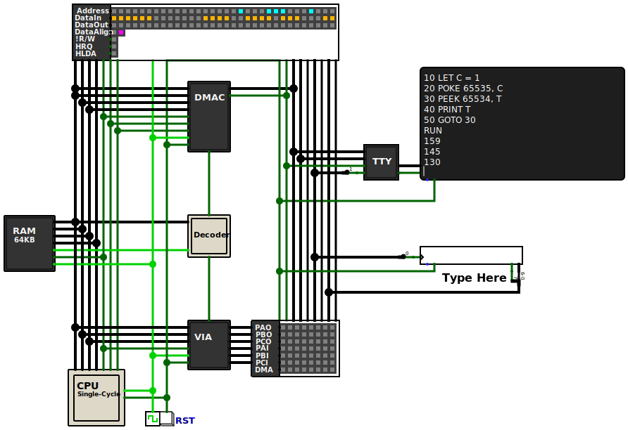
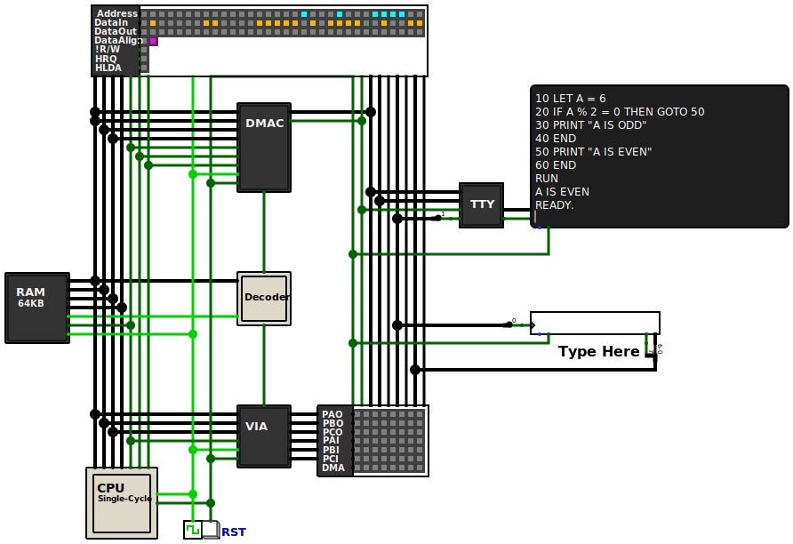
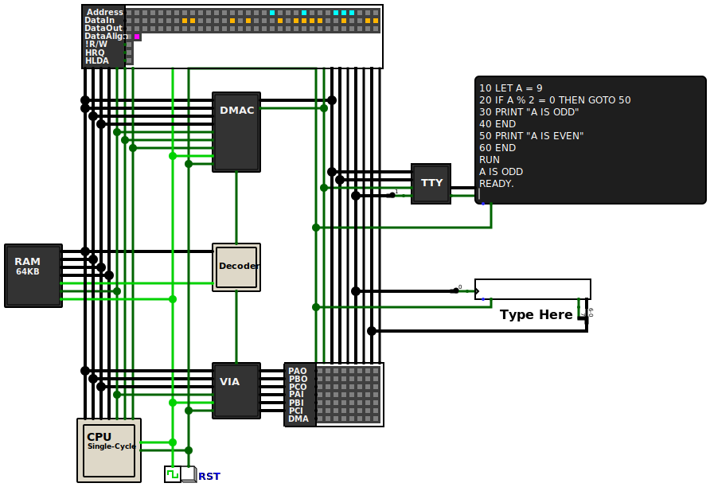

# Veecom uBASIC

#### A Simple Interactive BASIC Interpreter for Veecom.

## Table of Contents
* [Introduction](#intro) 
* [Variables](#variables) 
* [Mathematical Operators](#math_operators) 
* [Logical Operators](#logical_operators) 
* [Control Flow](#control_flow) 
* [PEEK-POKE](#peek_poke) 
* [Additional Commands](#additional_commands) 
* [Examples](#examples) 
* [Configuring uBASIC](#config)  
* [Compiling and Building uBASIC](#compile_build)  

### Introduction 

Veecom uBASIC is a derivative of the [uBASIC](https://dunkels.com/adam/ubasic/) interpreter originally authored by Adam Dunkels. This version of uBASIC has been improved to be made fully interactive, with the incorporation of additional commands and performance optimizations.

<figure align="center">
    
</figure>

The interpreter provides flexibility in input methods, allowing users to either write commands directly or use line numbers.

#### Direct Command Input:

    PRINT "HELLO, WORLD!"

#### Line-Numbered Programming:

    10 PRINT "HELLO, WORLD!"
    20 END

Direct commands are executed right away, whereas Line-Numbered commands require the execution of the `RUN` command afterward.

 

###  Variables 

There is only support for integer variables and the variables can only have single character names (A-Z).

#### Valid Assignment
    10 LET A = 10
    20 LET B = 2 * A
    30 LET C = B - A

#### Invalid Assignment
    10 LET CE = 9
    20 LET A = 2.4

 

### Mathematical Operators 
    
#### Addition ( + ):
    LET N = 10 + 6

#### Subtraction ( - ):
    LET N = 10 - 6

#### Multiplication ( * ):
    LET N = 10 * 6

#### Division ( / ):
    LET N = 10 / 6

#### Modulus ( % ):
    LET N = 10 % 6

 

### Logical Operators 

#### Logical And ( & ):
    LET N = 10 & 6

#### Logical Or ( | ):
    LET N = 10 | 6

#### Less Than ( < ):
    IF A < B THEN ...

#### Greater Than ( > ):
    IF A > B THEN ...

#### Equal ( = ):
    IF A = B THEN ... 

 

### Control Flow 

#### IF-THEN Statement

    IF A < B THEN PRINT "A IS LESS"

#### FOR-NEXT Statement

    10 FOR I = 1 TO 3
    20 PRINT I * I
    30 NEXT I
    40 END

    1
    4
    9

#### GOTO Statement

    10 PRINT "HELLO, WORLD!"
    20 GOTO 10

    HELLO, WORLD!
    HELLO, WORLD!
    HELLO, WORLD!
    HELLO, WORLD!
    HELLO, WORLD!
    ...

#### GOSUB-RETURN

    10 GOSUB 100
    20 PRINT "RETURNED FROM SUBROUTINE"
    30 END
    100 PRINT "SUBROUTINE"
    110 RETURN

    SUBROUTINE
    RETURNED FROM SUBROUTINE

### PEEK-POKE 

#### PEEK
`A` is assigned to the value held at address `65535`

    PEEK 65535, A

Variables can be used to hold addresses

    10 LET A = 65532
    20 PEEK A, B

#### POKE

The memory address is assigned to the value held by `A`

    10 LET A = 72
    20 POKE 65534, A

 

### Additional Commands 

#### RUN

The `RUN` is used to start the execution of Line-Numbered programs

    10 PRINT "HELLO, WORLD!"
    20 GOTO 10
    
    RUN
    HELLO, WORLD!
    HELLO, WORLD!
    HELLO, WORLD!
    ...
    
#### LIST
 The `LIST` command is used to view the lines of uBASIC code that you have entered into the computer.

    10 PRINT "HELLO, WORLD!"
    20 FOR I = 1 TO 10
    30   PRINT I
    40 NEXT I

#### LIST 20
    20 FOR I = 1 TO 10

#### LIST -30

    10 PRINT "HELLO, WORLD!"
    20 FOR I = 1 TO 10
    30   PRINT I

#### LIST 30-40
    30   PRINT I
    40 NEXT I

#### LIST 20-
    20 FOR I = 1 TO 10
    30   PRINT I
    40 NEXT I

#### NEW

The `NEW` command erases the content of uBASIC program memory

    LIST
    10 PRINT "HELLO, WORLD!"
    READY.

    NEW
    READY.

    LIST

    READY.

#### FRE
The `FRE` command displays the remaining bytes available for the uBASIC program

    FRE
    2100 uBASIC BYTES FREE

 

### Examples 

#### Printing the alphabet to the terminal
    
    REM SET VARIABLE A TO THE ADDRESS OF PORT A OUTPUT (PAO)
    10 LET A = 65528
    20 FOR I = 65 TO 90
    30 POKE A, I | 128
    40 POKE A, 0
    50 NEXT I
    60 POKE A, 10
    70 POKE A, 0
    80 END

<figure align="center">
    
</figure>

#### Reading the timer value
    
    REM CONFIGURE AND START THE TIMER IN ONE-SHOT MODE
    10 LET C = 1
    20 POKE 65535, C
    30 PEEK 65534, T
    40 PRINT T
    50 GOTO 30

<figure align="center">
    
</figure>

#### Odd-Even

When `A` equal to 6

    10 LET A = 6
    20 IF A % 2 = 0 THEN GOTO 50
    30 PRINT "A IS ODD"
    40 END
    50 PRINT "A IS EVEN"
    60 END

<figure align="center">
    
</figure>

 

When `A` equal to 9

    10 LET A = 9
    ...

<figure align="center">
    
</figure>

 

### Configuring uBASIC <a name="config">

Veecom uBASIC can be customized from the `ubasic_config.h` file.

### Compiling and Building uBASIC 

You'll need a RISC-V C/C++ compiler, I personally use <a href="https://gnutoolchains.com/risc-v/"> this one </a> for my windows machine.  
Download and install `risc-v-gcc10.1.0.exe` and leave things to defaults.  
Open the terminal, navigate to `Veecom-uBASIC` folder and type `make`.  

From logisim load the `final.bin` file into Veecoms' main memory module.
